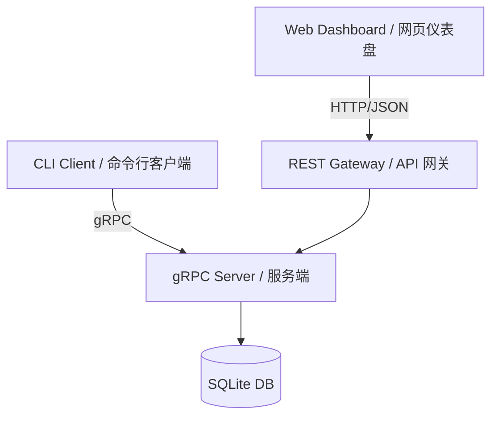

# MeetingFlow

[English](./README.md) | [中文](./README.md#中文内容)

---

## 🚀 Overview / 项目概述

**MeetingFlow** is a professional meeting room booking system built with **gRPC**, **TypeScript**, **Node.js**, and **React**. It features a high-performance gRPC backend and a premium, minimalist dark-mode web dashboard.

**MeetingFlow** 是一个基于 **gRPC**、**TypeScript**、**Node.js** 和 **React** 构建的专业会议室预约系统。它拥有高性能的 gRPC 后端以及简约高级的暗黑模式网页仪表盘。

---

## ✨ Features / 功能特性

- 🔌 **gRPC Communication** — Strict Proto3 interface implementation for reliable distributed communication.
  - **gRPC 通信** — 严格的 Proto3 接口实现，确保可靠的分布式通信。
- 🛡️ **Smart Conflict Detection** — Real-time logic to prevent overlapping bookings in the same room.
  - **智能冲突检测** — 实时逻辑防止同一房间的预约时间重叠。
- 🖥️ **Premium Web Dashboard** — Glassmorphism UI with real-time statistics, search, and booking status.
  - **高级网页仪表盘** — 毛玻璃风格 UI，支持实时统计、搜索和预约状态展示。
- 💻 **Interactive CLI Client** — Beautiful terminal experience for developers.
  - **交互式命令行客户端** — 为开发者提供的精美终端体验。
- 💾 **Persistent Storage** — Power by SQLite with Prisma ORM.
  - **持久化存储** — 使用 Prisma ORM 配合 SQLite。

---

## 🏗️ Architecture / 系统架构



---

## 📦 Quick Start / 快速上手

### 1. Installation / 安装
```bash
# Install root dependencies / 安装根目录下依赖
npm install

# Install web dashboard dependencies / 安装网页端依赖
npm install --prefix client-web
```

### 2. Database Setup / 数据库设置
```bash
npm run db:migrate
# Optional: Seed sample data / 可选：注入演示数据
npx ts-node prisma/seed.ts
```

### 3. Run / 运行
```bash
# Start all services (Server + Web) / 启动所有服务（服务端 + 网页）
npm run dev

# Start CLI in another terminal / 在另一个终端启动命令行
npm run cli
```

---

## 📡 API Reference / 接口参考

| Method / 方法 | Description / 描述 |
|---|---|
| `BookMeeting` | Create a new reservation / 创建新预约 |
| `QueryById` | Get details by ID / 按 ID 查询详情 |
| `QueryByOrganizer` | List by organizer / 按预约人查询 |
| `CancelMeeting` | Delete a reservation / 取消预约 |

---

## <a name="中文内容"></a> 🎨 预览与设计 (Project Preview)

- **Web UI**: React 19 + Tailwind v4 + Framer Motion.
- **Backend**: Node.js + gRPC-js.
- **Persistence**: Prisma v5 + SQLite.

---

*Xidian University · Computer Networks & Distributed Systems Course Project*
*西安电子科技大学 · 计算机网络与分布式系统课程实验*
