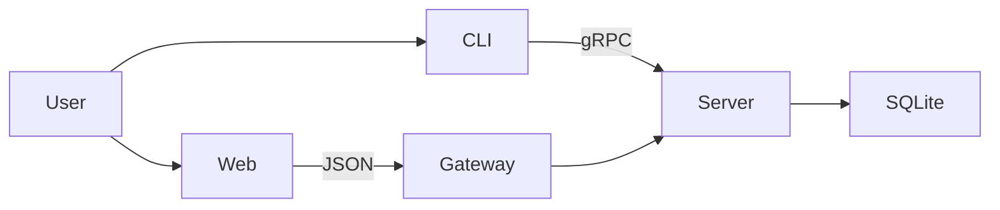

# MeetingFlow Design Document / 项目设计文档

> **Guideline / 准则**: Read this before coding. Update after every change. / 开发前阅读，变更后立即更新。

---

## 1. Project Overview / 项目概况

**EN**: MeetingFlow is a distributed booking system fulfilling university course requirements while maintaining professional engineering standards.
**ZH**: MeetingFlow 是一个满足大学课程要求并保持专业工程标准的分布式预约系统。

## 2. Technical Stack / 技术栈

| Component / 组件 | Technology / 技术 | Rationale / 理由 |
| :--- | :--- | :--- |
| **RPC** | gRPC (Proto3) | Industry standard for strong typing / 工业级强类型标准 |
| **Language / 语言** | TypeScript v6 | Type safety & maintainability / 类型安全与可维护性 |
| **Frontend / 前端** | React + Tailwind v4 | High-performance premium UI / 高性能、高质量 UI |
| **DB / 数据库** | Prisma + SQLite | Easy to deploy, zero config / 易于部署，零配置 |
| **DevOps / 部署** | Docker Compose | Professional containerized delivery / 专业级容器化交付 |

## 3. Architecture / 架构设计

**EN**: The system uses a **Dual-Mode Server** (gRPC + REST Gateway) to support both native binary protocols and browser-based HTTP clients.
**ZH**: 系统采用**双模服务器**（gRPC + REST 网关），同时支持原生二进制协议和基于浏览器的 HTTP 客户端。

## 4. Business Logic / 业务逻辑

### Conflict Detection / 冲突检测
- **Logic**: A meeting is rejected if `new.startTime < existing.endTime` AND `new.endTime > existing.startTime` for the same room.
- **逻辑**: 如果同一房间满足 `新开始时间 < 已有结束时间` 且 `新结束时间 > 已有开始时间`，则视为冲突。

## 5. Web Dashboard Structure / 网页仪表盘结构

- **StatsBar**: Real-time aggregation of booking data. / 预约数据的实时聚合统计。
- **MeetingCard**: Dynamic status display (Upcoming/Ongoing/Finished). / 动态状态展示（即将、进行中、已结束）。
- **BookingModal**: Form with real-time server validation. / 带实时服务器验证的预约表单。

## 6. Implementation Status / 实现进度

1. [x] Phase 1: Core gRPC Server & SQLite / 核心服务端与数据库
2. [x] Phase 2: CLI Client / 命令行客户端
3. [x] Phase 3: Web REST Gateway & Dashboard / Web 网关与仪表盘
4. [x] Phase 4: Bilingual Documentation / 双语文档完善
5. [x] Phase 5: Docker Containerization / Docker 容器化交付环境

---
*Last Updated / 最后更新: 2026-04-19*
