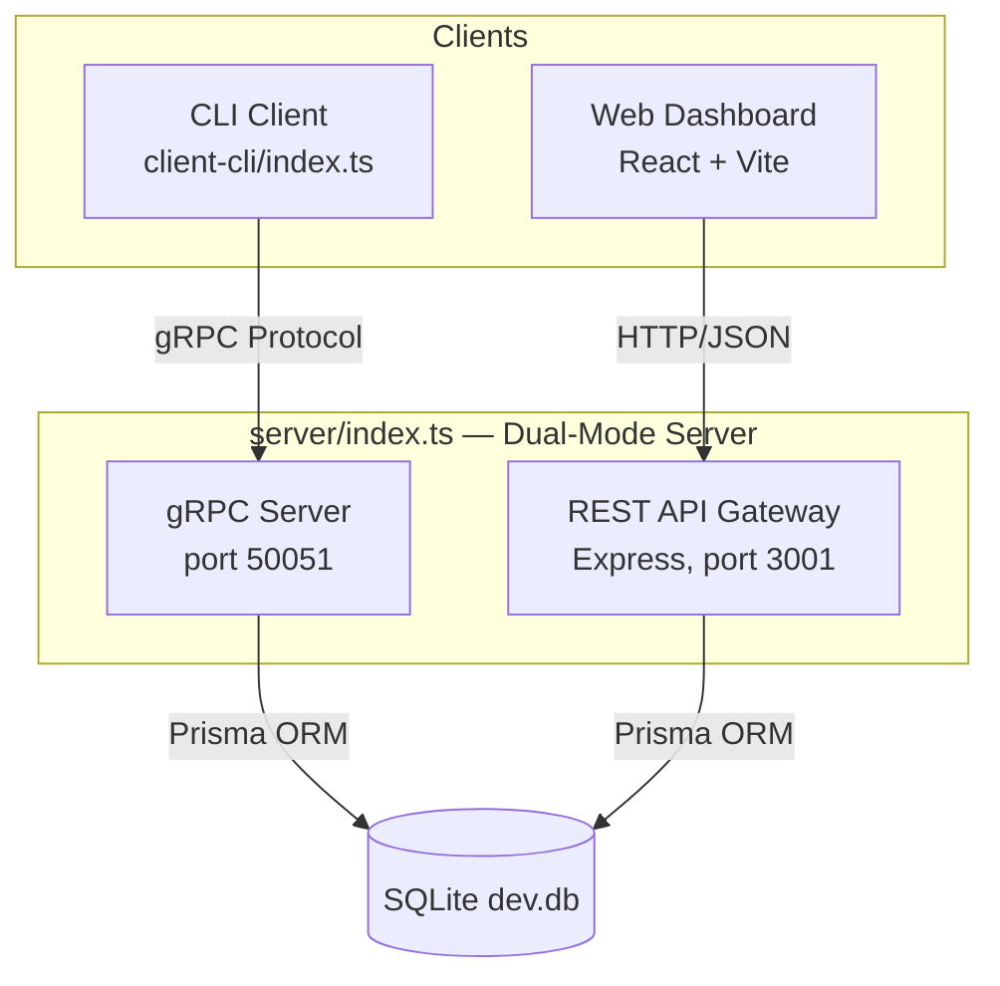

# MeetingFlow: High-Quality RPC Meeting Management System

> **Developer Directive:** Read this document before writing any code. Update it immediately after every code change.

## 1. Project Overview

MeetingFlow is a distributed meeting room booking system built with **Node.js**, **TypeScript**, and **gRPC**. It fulfills the Xidian University course requirements while also serving as a professional GitHub portfolio project.

## 2. Technical Stack

| Component | Technology | Version | Rationale |
| :--- | :--- | :--- | :--- |
| **Communication** | gRPC (Proto3) | `@grpc/grpc-js` v1.14 | Industry standard, strong typing |
| **Language** | TypeScript | v6 | Type safety, professional |
| **Runtime** | Node.js | v18+ | gRPC support |
| **Database** | SQLite + Prisma ORM | v7.7 | Persistent, zero-config |
| **CLI Client** | `@clack/prompts` | v1.2 | Interactive, beautiful terminal |
| **Web Frontend** | React + Vite + Tailwind v4 | Vite v8 | Modern, fast, premium UI |
| **Web Framework** | Express | v5 | REST API gateway |

## 3. System Architecture

## 4. RPC Interface (Core Requirements)

File: `proto/meeting.proto`

| Method | Request | Response | Description |
|:---|:---|:---|:---|
| `BookMeeting` | `Meeting` | `BookResponse` | Create with conflict detection |
| `QueryById` | `QueryByIdRequest` | `Meeting` | Get by ID |
| `QueryByOrganizer` | `QueryByOrganizerRequest` | `MeetingList` | Get all for organizer |
| `CancelMeeting` | `CancelMeetingRequest` | `CancelResponse` | Delete booking |

## 5. REST API (Web Dashboard Gateway)

Base: `http://localhost:3001/api`

| Method | Path | Description |
|:---|:---|:---|
| `GET` | `/meetings` | List all meetings |
| `GET` | `/meetings/stats` | Dashboard statistics |
| `GET` | `/meetings/:id` | Get single meeting |
| `POST` | `/meetings` | Create meeting (with conflict check) |
| `DELETE` | `/meetings/:id` | Cancel meeting |

## 6. Data Model

| Field | Type | Description |
| :--- | :--- | :--- |
| `id` | Integer | Auto-increment unique ID |
| `organizer` | String | Name of organizer |
| `roomName` | String | Room identifier |
| `subject` | String | Meeting topic |
| `startTime` | DateTime | ISO 8601 / stored as DB DateTime |
| `endTime` | DateTime | ISO 8601 / stored as DB DateTime |
| `participants` | Integer | Number of attendees |

## 7. Web Dashboard Components

| Component | File | Purpose |
|:---|:---|:---|
| `App` | `App.tsx` | Main layout, data fetching, search, auto-refresh |
| `StatsBar` | `components/StatsBar.tsx` | 4-card statistics (total, rooms, participants, completed) |
| `MeetingCard` | `components/MeetingCard.tsx` | Individual meeting row with status badge |
| `StatusBadge` | `components/StatusBadge.tsx` | Auto-computed Upcoming/Ongoing/Completed badge |
| `BookingModal` | `components/BookingModal.tsx` | Full booking form modal with conflict error feedback |

## 8. Scripts

| Command | Description |
|:---|:---|
| `npm run server` | Start gRPC + REST server |
| `npm run cli` | Start interactive CLI |
| `npm run web:dev` | Start web dashboard (dev mode) |
| `npm run dev` | Start server + web concurrently |
| `npm run db:migrate` | Apply DB schema migrations |
| `npm run db:studio` | Open Prisma visual DB browser |

## 9. Implementation Workflow

1. [x] **Phase 0**: Design document
2. [x] **Phase 1**: Proto definition + gRPC server + SQLite  
3. [x] **Phase 2**: CLI interactive client
4. [x] **Phase 3**: Web dashboard (full CRUD + stats)
5. [x] **Phase 4**: Polish — README, gitignore, scripts, TS fix, Tailwind v4 migration
6. [x] **Phase 5**: Verification — TypeScript passes, Vite build passes

## 10. Known Issues / Decisions

- **Prisma v7**: Uses `require('@prisma/client')` in server code due to v7's TS type export changes
- **Tailwind v4**: Uses `@import "tailwindcss"` + `@theme {}` block instead of `tailwind.config.js`
- **tsconfig**: Uses `node10` module resolution with `ignoreDeprecations: "6.0"` for TS6 compatibility

---
*Created on: 2026-04-18 | Last Updated: 2026-04-18 (Full upgrade)*
